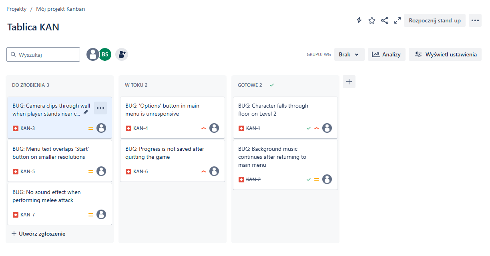
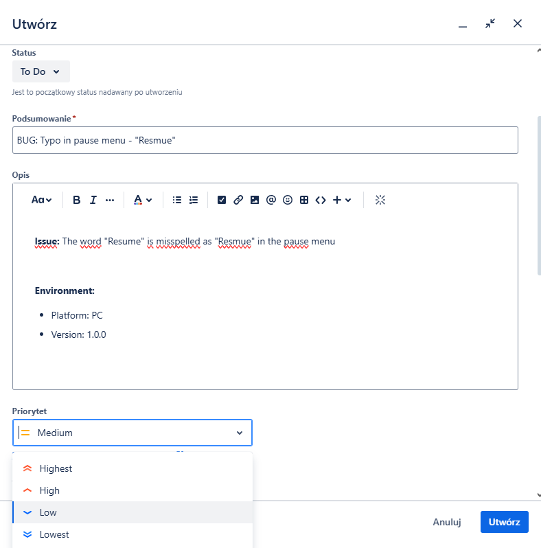

#  QA Bug Report Practice – Game Testing Portfolio

This mini-repo shows my basic QA/testing skills using JIRA and bug reporting, focused on game testing scenarios.
Includes sample bug reports with priorities, reproduction steps, and expected results.

---

##  Tools Used

- JIRA (Kanban board, issue creation, priorities)
- Markdown (for writing clean reports)
- Manual testing logic (test cases, repro steps)

---

## Sample Bug Reports

### 1.  "Start Game" button not working
**Priority:** High
- **Steps to Reproduce:** Open main menu → Click "Start Game"
- **Expected:** Game starts normally
- **Actual:** Nothing happens

### 2.  Character hangs in mid-air after jump
**Priority:** Medium
- **Steps to Reproduce:** Level 1 → Jump off moving platform
- **Expected:** Character lands smoothly
- **Actual:** Character floats for 1-2 seconds before falling

### 3.  Typo in pause menu
**Priority:** Low
- **Issue:** "Resume" is spelled as "Resmue"

---

##  Screenshots

###  Kanban board in JIRA

*Organized bug reports with statuses: To Do, In Progress, Done.*

###  Detailed bug report view

*Includes steps to reproduce, expected vs actual result, and environment info.*

###  Creating a new bug with priority selection

*Shows how a typo bug is reported and priority is selected.*

---

##  Summary

This project reflects my QA mindset and ability to identify, prioritize, and report bugs in a structured way using JIRA.
Looking forward to growing in game QA and working with dev teams.
